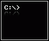

# Curso Terminal y Lineas de Comandos

La terminal y línea de comandos es una herramienta esencial para todo desarrollador de software, sin importar su área de especialización, pues se encuentra presente de forma universal. En este curso aprenderás a aprovechar el potencial de los sistemas operativos basados en ``UNIX`` siendo capaz de dominar los comandos básicos de la termina, realizar búsquedas que agilicen tu trabajo y administrar permisos en tu equipo.

## ¿Que es una terminal?
Interfaz grafica que nos muestra el prompt que podemos introducir lineas de comando

## ¿Que es una linea de comandos?
(Shell) programa que interpreta comandos del usuario y los ejecuta en el sistema operativo

Esta `terminal` solo lo que arroja es la `shell` 